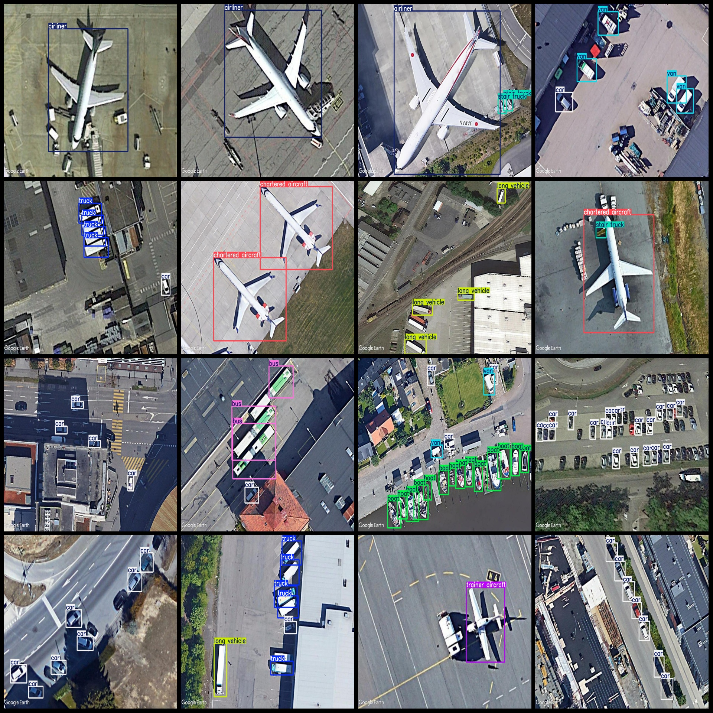
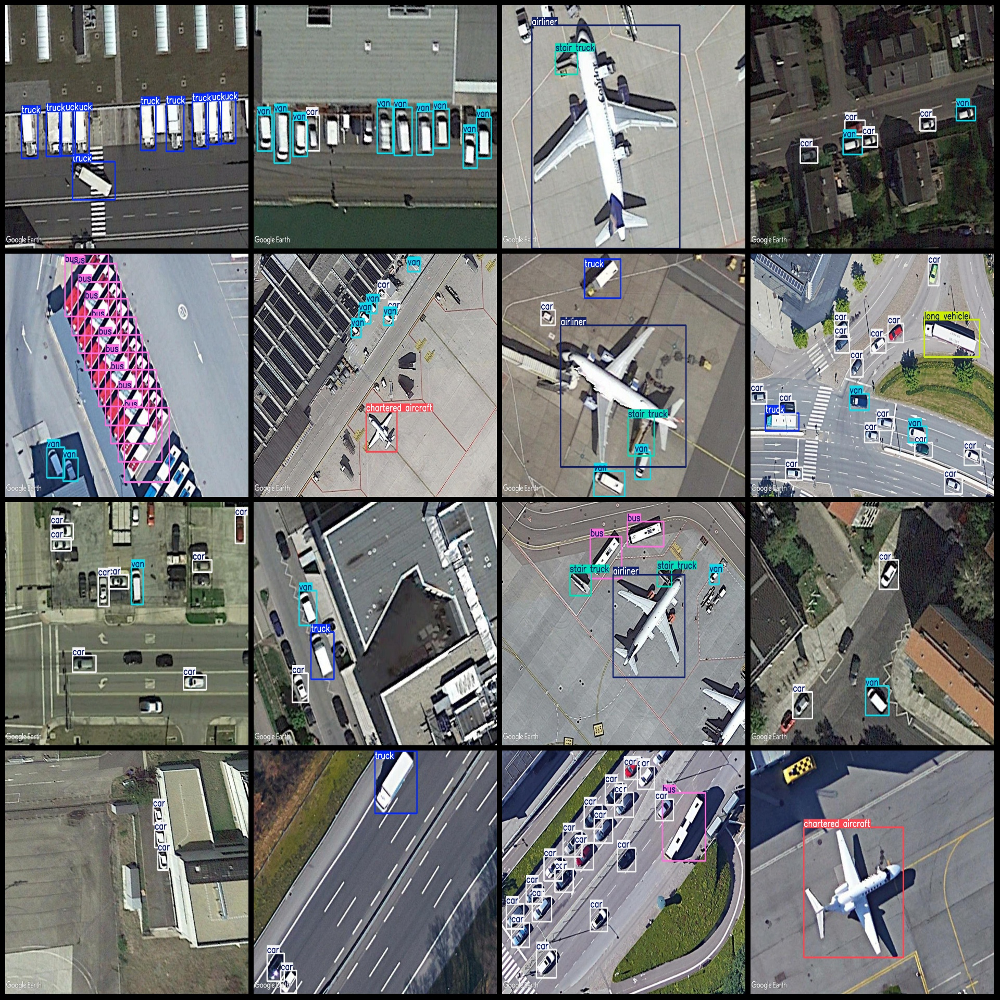

# Satellite Image Trained Vehicle Inspection Dataset VOC+YOLO format with 4995 images in 14 categories

Dataset format: Pascal VOC format + YOLO format (txt file without split path, only containing jpg images and corresponding VOC format xml files and yolo format txt files)
Number of images (jpg file count): 4995
Number of annotations (xml file count): 4995
Number of annotations (txt file count): 4995
Number of annotation classes: 14
Annotation class names (note that the order of classes in the yolo format does not correspond to this, but is based on the classes.txt in the labels folder): ["airliner", "boat", "bus", "car", "chartered aircraft", "fighter aircraft", "helicopter", "long vehicle", "propeller aircraft", "pushback truck", "stair"]
truck","trainer aircraft","truck","van"]  
The number of bounding boxes per category is as follows:
Airliner (Commercial Airplane): 966
Boat (Vessel): 8681
Bus (Public Transport): 1989
Car (Motor Vehicle): 20529
Chartered Aircraft (Private Jet): 634
Fighter Aircraft (MiG/F-16): 49
Helicopter (Rotorcraft): 60
Long Vehicle (Truck/Bus): 1622
Propeller Aircraft (Cessna): 195
Pushback Truck (Forklift/Wheechair): 208
Stair Truck (Escalator/Lift): 441
Trainer Aircraft (Trainer Plane): 631
Truck (Truck): 2799
Van (Truck/Minivan): 5730
Total bounding box count: 44534

The number of images per category is as follows:
Airliner (Commercial Airplane): 785
Boat (Vessel): 434
Bus (Public Transport): 635
Car (Motor Vehicle): 2800
Chartered Aircraft (Private Jet): 353
Fighter Aircraft (MiG/F-16): 30
Helicopter (Rotorcraft): 48
Long Vehicle (Truck/Bus): 520
Propeller Aircraft (Cessna): 141
Pushback Truck (Forklift/Wheechair): 130
Stair Truck (Escalator/Lift): 266
Trainer Aircraft (Trainer Plane): 200
Truck (Truck): 999
Van (Truck/Minivan): 2231
Image resolution: 1024x768
LabelImg was used for labeling.
Labeling rules: A bounding box is drawn around the category.
Special note: The dataset does not have a training/validation/test split and must be manually divided.
Disclaimer: This dataset does not guarantee any accuracy in the trained models or weights files.
Picture preview:

Here is a pay link on Stripe ( https://buy.stripe.com/3cs8yP7sY87d0vu9AB ). Please contact me lonlonago@foxmail.com after funding $89, and I will send you a complete data files , thank you!

